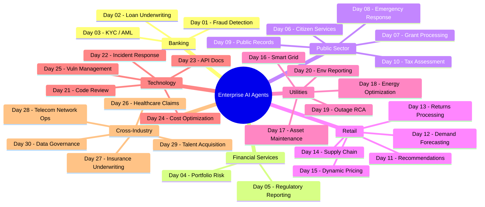
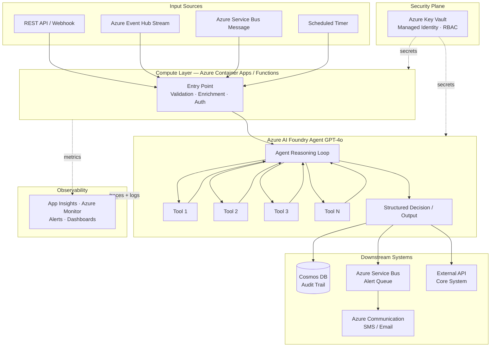
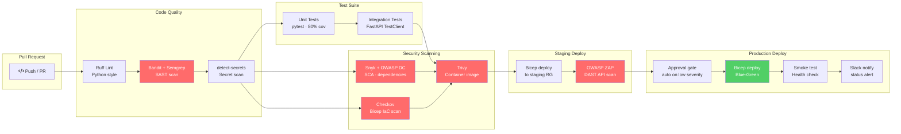
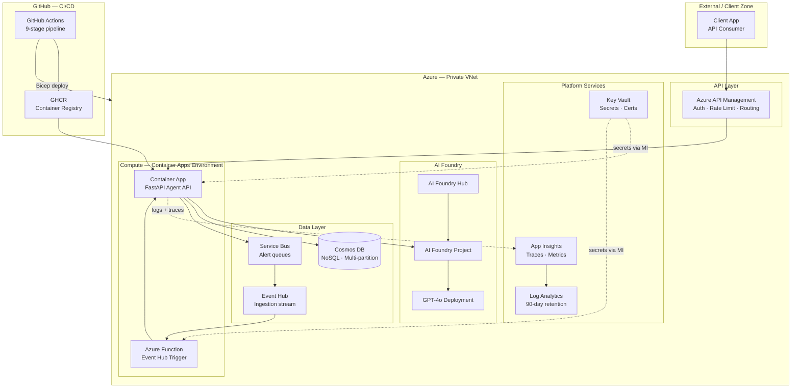

# Enterprise AI Agents — 30-Day Build Series

Production-ready AI agents across Banking, FS, Public Sector, Retail, Utilities, and Technology verticals.

**Platform:** Azure AI Foundry + Azure Services &nbsp;|&nbsp; **IaC:** Bicep &nbsp;|&nbsp; **CI/CD:** GitHub Actions &nbsp;|&nbsp; **Security:** Trivy · Bandit · OWASP ZAP · Snyk · Checkov

---

## High-Level Agent Landscape



---

## Standard Agent Architecture (All 30 Agents)

Every agent follows the same layered enterprise pattern — input source → trigger → AI Foundry Agent → downstream action.



---

## Standard CI/CD Pipeline (All Agents)

Every agent ships through this 9-stage hardened pipeline before reaching production.



---

## Azure Infrastructure Topology (Shared Pattern)



---

## Agent Registry

| Day | Agent | Industry | Status | Folder |
|-----|-------|----------|--------|--------|
| 01 | Fraud Detection & Real-Time Alert | Banking | ✅ Complete | [day-01-fraud-detection](./day-01-fraud-detection) |
| 02 | Loan Underwriting Copilot | Banking | 🔜 Planned | day-02-loan-underwriting |
| 03 | KYC/AML Compliance Automation | Banking | 🔜 Planned | day-03-kyc-aml |
| 04 | Portfolio Risk & Market Intelligence | FS | 🔜 Planned | day-04-portfolio-risk |
| 05 | Regulatory Reporting Automation | FS | 🔜 Planned | day-05-regulatory-reporting |
| 06 | Citizen Services Chatbot | Public | 🔜 Planned | day-06-citizen-services |
| 07 | Grant Application Processing | Public | 🔜 Planned | day-07-grant-processing |
| 08 | Emergency Response Coordination | Public | 🔜 Planned | day-08-emergency-response |
| 09 | Public Records Search | Public | 🔜 Planned | day-09-public-records |
| 10 | Tax Assessment & Appeals | Public | 🔜 Planned | day-10-tax-assessment |
| 11 | Product Recommendation | Retail | 🔜 Planned | day-11-recommendations |
| 12 | Inventory Demand Forecasting | Retail | 🔜 Planned | day-12-demand-forecasting |
| 13 | Returns & Refund Processing | Retail | 🔜 Planned | day-13-returns-processing |
| 14 | Supply Chain Intelligence | Retail | 🔜 Planned | day-14-supply-chain |
| 15 | Dynamic Pricing Optimization | Retail | 🔜 Planned | day-15-dynamic-pricing |
| 16 | Smart Grid Anomaly Detection | Utilities | 🔜 Planned | day-16-smart-grid |
| 17 | Predictive Asset Maintenance | Utilities | 🔜 Planned | day-17-asset-maintenance |
| 18 | Energy Consumption Optimization | Utilities | 🔜 Planned | day-18-energy-optimization |
| 19 | Outage Root Cause Analysis | Utilities | 🔜 Planned | day-19-outage-rca |
| 20 | Environmental Compliance Reporting | Utilities | 🔜 Planned | day-20-env-reporting |
| 21 | Code Review & Security Audit | Tech | 🔜 Planned | day-21-code-review |
| 22 | IT Incident Response & RCA | Tech | 🔜 Planned | day-22-incident-response |
| 23 | API Documentation Generator | Tech | 🔜 Planned | day-23-api-docs |
| 24 | Cloud Cost Optimization | Tech | 🔜 Planned | day-24-cost-optimization |
| 25 | Vulnerability Management & Patching | Tech | 🔜 Planned | day-25-vuln-management |
| 26 | Healthcare Claims Processing | Healthcare | 🔜 Planned | day-26-claims-processing |
| 27 | Insurance Underwriting & Risk | Insurance | 🔜 Planned | day-27-underwriting |
| 28 | Telecom Network Operations | Telecom | 🔜 Planned | day-28-network-ops |
| 29 | Talent Acquisition & Screening | HR | 🔜 Planned | day-29-talent-acquisition |
| 30 | Data Governance & Lineage | Cross-Industry | 🔜 Planned | day-30-data-governance |

---

## Security Baseline (All Agents)

| Layer | Tool | What It Checks |
|-------|------|---------------|
| SAST | Bandit + Semgrep | Python code vulnerabilities, OWASP Top 10 |
| SCA | Snyk + OWASP DC | Dependency CVEs, license issues |
| Secrets | detect-secrets | Hardcoded credentials in code |
| Container | Trivy | Image CVEs, misconfigurations |
| IaC | Checkov | Bicep security misconfigurations |
| DAST | OWASP ZAP | Live API endpoint scanning |
| Runtime | Azure Defender | Threat detection in production |

---

## Getting Started

```bash
# Prerequisites: Azure CLI · GitHub CLI · Python 3.11+ · Docker

git clone https://github.com/anoopkum/enterprise-ai-agents.git
cd enterprise-ai-agents/day-01-fraud-detection

cp .env.example .env   # fill in your Azure values
az login
./deploy.sh
```

---

*Built by [@anoopkum](https://github.com/anoopkum) &nbsp;|&nbsp; Azure AI Foundry &nbsp;|&nbsp; Enterprise Grade*
