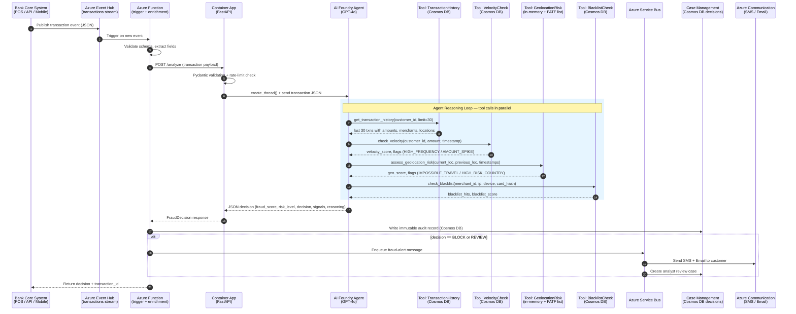
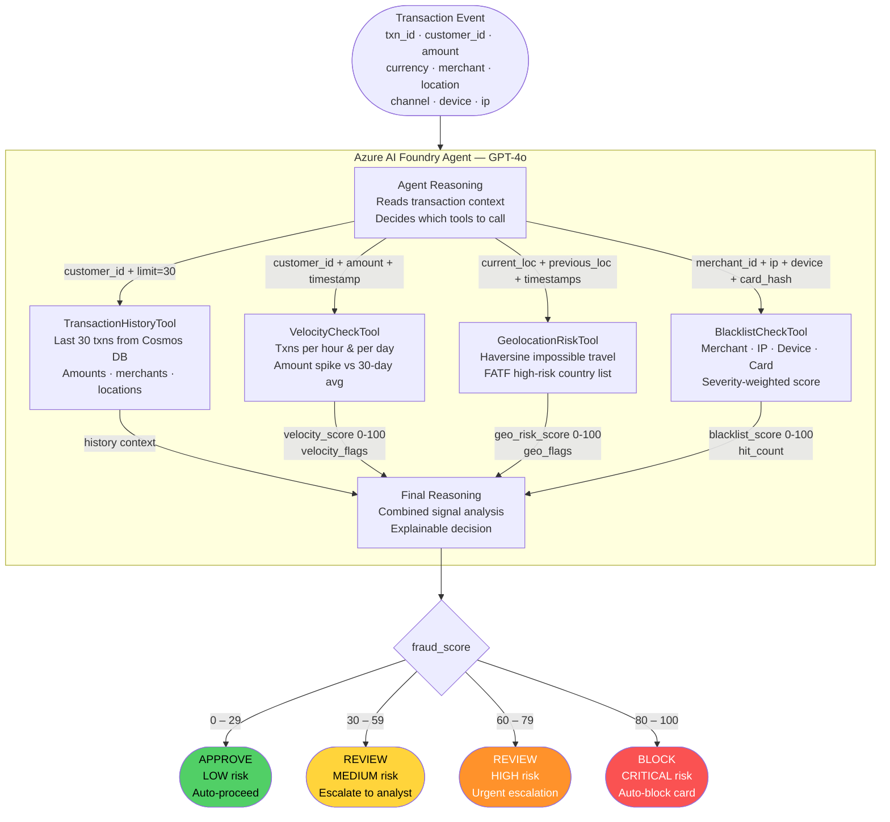
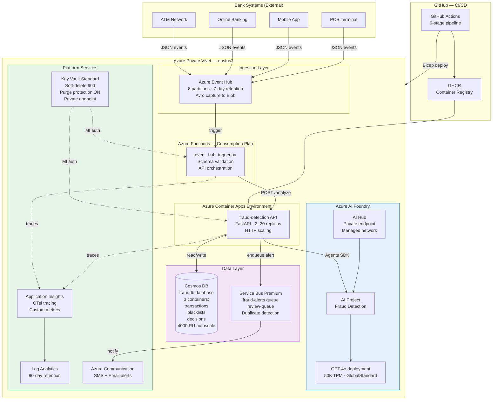
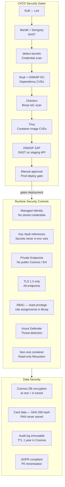
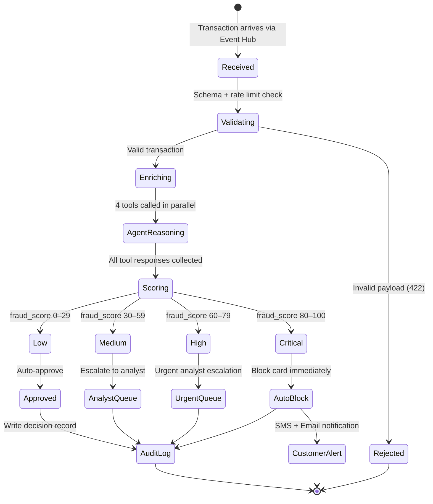

# Day 01 — Fraud Detection & Real-Time Alert Agent

**Industry:** Banking &nbsp;|&nbsp; **Platform:** Azure AI Foundry + Event Hubs + Container Apps &nbsp;|&nbsp; **Status:** ✅ Complete

---

## What This Agent Does

A bank transaction arrives (POS, online, ATM, mobile). Within **200ms** this agent:
1. Enriches it with 30-day history, velocity patterns, geolocation, and blacklist signals
2. Sends all signals to GPT-4o via Azure AI Foundry for reasoning
3. Returns an explainable decision: **APPROVE / REVIEW / BLOCK**
4. Writes an immutable audit record and fires alerts to ops and customer

---

## End-to-End Transaction Flow



---

## Agent Tool Orchestration

How GPT-4o reasons over the 4 tools to produce a final risk score:



---

## Azure Infrastructure Architecture



---

## Security Architecture



---

## Data Flow & Decision Logic



---

## Tech Stack

| Component | Technology |
|-----------|-----------|
| Agent Framework | Azure AI Foundry Agents SDK |
| LLM | GPT-4o (deployed via Azure AI Foundry) |
| Stream Ingestion | Azure Event Hubs (8 partitions) |
| Compute | Azure Container Apps + Azure Functions |
| Database | Azure Cosmos DB (NoSQL, 3 containers) |
| Alerting | Azure Service Bus Premium + Azure Communication Services |
| Secrets | Azure Key Vault (Private Endpoint, Purge Protection) |
| Observability | Azure Monitor + Application Insights + OpenTelemetry |
| IaC | Bicep (7 modules) |
| CI/CD | GitHub Actions (9 stages) |
| Security | Trivy · Bandit · Semgrep · OWASP ZAP · Snyk · Checkov |

---

## Key Features

- **Real-time scoring** — <200ms p99 latency end-to-end
- **Explainable AI** — every decision includes human-readable reasoning + signal list
- **Multi-signal fusion** — velocity, geolocation (Haversine), merchant category, device, IP blacklist
- **Risk tiers** — LOW auto-approve, MEDIUM/HIGH analyst queues, CRITICAL auto-block
- **Immutable audit trail** — 1-year retention in Cosmos DB for regulatory compliance
- **RBAC** — all role assignments provisioned via Bicep, Managed Identity throughout

---

## Deployment

```bash
cd day-01-fraud-detection
cp .env.example .env       # fill in subscription, resource group, AI Foundry conn string
az login
./deploy.sh                # provisions all 7 Bicep modules + deploys Container App
```

## Testing

```bash
pip install -r requirements-dev.txt
pytest tests/unit -v --cov=src --cov-report=term-missing
pytest tests/integration -v
```

## Security Controls Summary

| Control | Implementation |
|---------|---------------|
| Zero stored credentials | Azure Key Vault + Managed Identity |
| Network isolation | Private Endpoints on Cosmos DB, Key Vault, Event Hub |
| Encryption | TLS 1.3 in transit, AES-256 at rest (Cosmos) |
| Card data | SHA-256 hash only — raw PAN never touches this system |
| Audit | Immutable decisions container, 1-year TTL |
| IaC security | Checkov scan on every PR, SARIF uploaded to GitHub |
| Container | Non-root user, no unnecessary packages, Trivy-clean |
